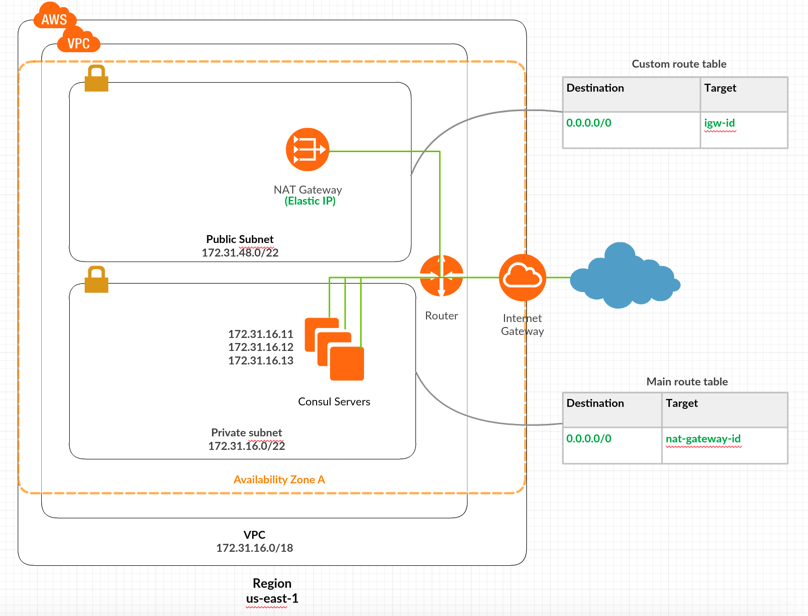

# Terraform module that will create a VPC on AWS with two subnets - Public and Private
- Private subnet have a route to the Public network nat_gateway.
- Public subnet have a route to the Internet Gateway
 - | The idea is one way connection from private subnet to help provisioning of the instances.
## Overview

## For example please navigate the example folder
